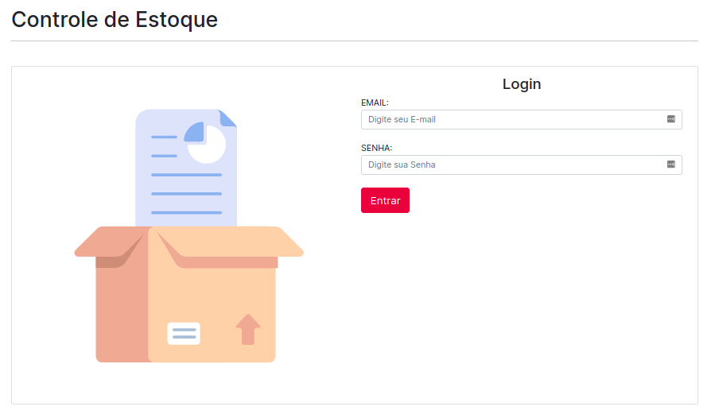
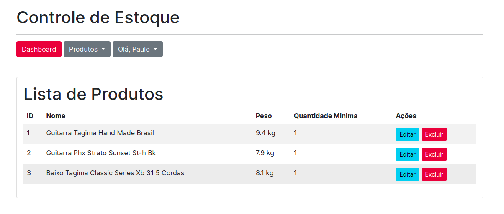
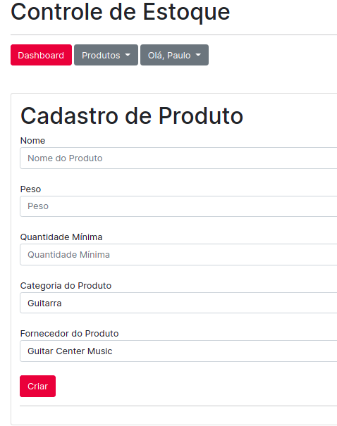

# Controle de Estoque
Sistema para controlar estoque desenvolvido na turma de PHP EAD da UTD (Ainda em contrução).

## Crie um banco de dados
Execute o conteúdo arquivo `script.sql`, para obter a estrutura do banco.

## Configuração do Banco
Alterar o arquivo `/Support/Config.php`

## Configuração do Sessão
Da permissão de escrita em `/storage/sessions/`

## Usuários de Acesso
Email|Senha
--- | ---
admin@email.com | admin
user@email.com| user

## Alguns Prints do sistema até aqui

#### Login

#### Lista de Produtos

#### Cadastro de Produtos
